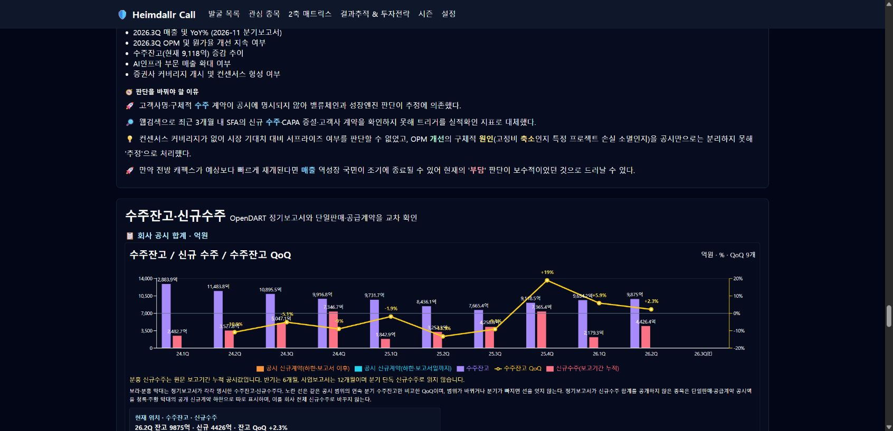

# 2026-10-08 수주잔고·신규수주·QoQ 복구

## 요청과 원인

종목 상세에서 공개된 수주잔고·신규수주·QoQ를 가져와 그래프로 표시한다. Telegram 연구는 사용하지 않는다. PRD §9.1, AGENTS.md, traps의 기존 수주 규약을 읽고 시작했다.

기존 운영 DB 페이징 기준 정기 발췌 11,861건 중 대표 수주 지표 2,111건·270기업, 명시 신규수주 8건이었다. 최신 원문 1,201기업을 직접 재생했고 원문 수집 실패는 0건이었다. 병합 머리글, 본문 뒤 상세표, 회사명 표제, 통화별 표, 문장형 수주잔고와 연도별 현재 행을 놓치는 파서가 주원인이었다. 수주 조회가 예외를 빈 배열로 반환하여 운영 장애도 숫자 없음처럼 보이는 문제가 있었다.

## 변경

- v6 구조화 파서: 명시 금액 열·단위·실제 보고기간 검증, 회사/사업부/통화 범위별 목록 저장. 한 표의 완전한 독립 항목만 합산하며, 일부 비공개이면 공개 항목 각각 보존한다. 원문 표제가 빈 총계는 명시 항목 합과 정확히 일치할 때만 승인한다.
- 별도 상세표와 현재 문장형 잔고, 날짜별 현재 행·각주의 당기 수주 정의, 신규수주 셀 단위, 현 최소구매물량의 확정 계약을 읽는다. 수주총액의 임의 잔고/신규수주 역산과 예상 구매 시나리오 합산은 금지한다.
- 화면은 공시 범위·통화별 그래프와 원문 링크를 표시한다. 외화는 백만USD/RMB/IDR로 표시하고 원화 공시계약 막대를 섞지 않는다. 같은 범위·통화·결산월의 연속 분기에만 QoQ를 계산한다. 부가 조회는 공통 재시도 뒤 경고로 전달한다.
- ADR 34, T257~258, PRD 규약을 기록했다. 다른 대화가 만든 파일과 무관한 pytest 폴더는 수정·스테이징하지 않는다.

## 실측 중간 결과

1차 4,043건 재검사/4,039건 갱신/누락 발췌 4건, 2차 4,241건/317건 추가 갱신/실패0, 3차 4,367건/900건 추가 갱신/실패0. 첫 누락 4건은 10월7일 새 기재정정으로 전체 발췌를 원문에서 수집해 복구했다. 갱신 횟수에는 동일 보고서의 후속 파서 재검증이 포함되므로 합계를 고유 보고서 수로 해석하지 않는다.

실제 원문 대조: SFA 26Q2 잔고 987,499백만원(9,874.99억원), 반기 신규 442,637백만원(4,426.37억원). HJ 조선19,043억원/건설8,330,749백만원. 엠앤씨 잔고9,331억원/당기890억원. 넥스틴 잔고8,978백만원/당기21,012백만원. 원익피앤이 현재 문장 잔고2,691억원. 삼성바이오로직스 확정 최소구매 잔고9,923백만USD(예상12,526 제외). 저스템 당해 신규71,782백만원이며 90,584백만원 수주총액을 잔고로 만들지 않았다.

최종 저장 재조회·전체 회귀·운영 배포/브라우저 검증 결과는 아래에 이어 기록한다. 단위가 빈 원문(한텍·톱텍 등), 수량만 공개하거나 잔고가 `-`인 표는 추측하지 않는다.

## 최종 저장 재조회와 화면 검증

- 운영 발췌 **12,039행**, 정기보고서 **11,866행**을 range 페이징으로 재조회했다. 실제 대시보드 변환 함수를 실행한 측정 보고서는 **3,166건·366기업**, 범위/통화별 시계열 **3,688점**, 수주잔고 **3,668점**, 명시 신규수주 **132점·14기업**, 외화 **237점**이다. 최초 최신 원문 1,201기업 스냅샷 중 측정 가능한 최신 기업은 **333**이다. 측정 보고서 수와 범위별 점 수를 혼동하지 않는다.
- 수정 후 추가 과거 보고서 **90건 재검사·55건 갱신·수집 실패0**, 새로 확인한 최초 5기업 보충 **32건·27건 갱신·실패0**. 후속 회귀 재생의 갱신은 중복 보고서를 포함한다. 새 기재정정 4건도 실제 원문 발췌로 복구했다.
- 저장값을 범위/통화별 최근 10개 보고기간으로 재생했다. 바로 인접한 같은 범위·통화·결산월의 잔고 QoQ는 **2,904점·346기업**이다. 전체 회사 범위와 주요계약 범위를 합산하지 않는다.
- 대표 **6/6**(SFA, 한화에어로스페이스, 삼성바이오로직스, 넥스틴, 엠앤씨솔루션, 원익피앤이)의 확인된 원문 금액을 최종 재조회 결과에 강제 대조했다. 숫자가 누락되면 검증을 실패 처리한다. 후반 원문 재생에서 비숫자/기간 있는 머리글 및 본문 단위 셀에 대한 회귀를 발견하고 교정했으며 T259와 실제 형태 회귀를 추가했다.
- **오프라인 1,298 passed·2 skipped·3 network deselected**, Next build **11/11**, `git diff --check` 정상. source와 unrelated pytest 폴더를 구분해 명시 파일만 저장했다.
- 운영 Chrome 실화면: SFA 회사 합계 **10분기 잔고/신규수주·QoQ 9개**, 최신 **9,874.99억/4,426.37억/+2.3%**. HJ 조선/건설 각각 **19,043억/-16.7%**, **83,307.49억/-0.2%**. 삼성바이오는 **9,923백만USD**와 원화 환산 금지 문구를 확인했다. 한화는 **10분기·최신 -2.7167%**, LS 본사 **69,998억/반기34,677억/+24.0549%**를 실제 변환으로 검증했다.
- 코드 `b0f9495`, `d49286e`를 main에 push했고 두 커밋 CI/Vercel 성공을 확인했다. 최종 머리글 교정·검증 기록은 후속 커밋에 함께 저장한다. 구버전 `b0f9495` 수주 작업 **37694823780**은 취소 완료하여 오래된 파서가 최종 검증 뒤 별도 표식을 쓰지 않게 했다. 평일 수주 예약은 유지한다.

## 확인 범위와 남은 한계

수주 수치가 있는 전 기업의 모든 IR까지 확보했다고 선언하지 않는다. 최신 원문 1,201기업과 복구 대상 최근 10분기를 확인했으며, 비공개·단위 미기재·통화/범위 모호 표는 결측 유지다. 한텍/톱텍 원문의 해당 수주 단위 칸은 비어 있다. 한텍의 KIND 등록 [2026 IR Book](https://kind.krx.co.kr/external/dst/irReference/18373/2026%EB%85%84%20IR%20Book%20(KOR).pdf) 19페이지도 확인했으나 2026년 반기 잔고와 대조 가능한 수치·단위를 확보하지 못했다. 친환경 시장규모와 5,000억원 수주 목표를 확정 잔고로 가져오지 않았다. SFA의 공식 IR 반기 잔고9,875억원도 DART 정밀값9,874.99억원과 대조했다. IR 문서를 새 데이터 소스로 자동 저장하는 일반 수집기는 이번 변경에 포함하지 않는다.

신규수주 합계가 원문에 없는 기업의 잔고에서 매출을 빼거나 더해 신규수주를 역산하지 않는다. 공개 단일판매 계약은 별도 하한 막대와 원문으로 남긴다. 반기/연간 누적 신규수주를 분기 단독값처럼 해석하지 않는다. Telegram 연구·유료 LLM·시험 Notion 페이지·주문 API 사용0이다.
